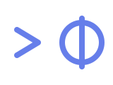
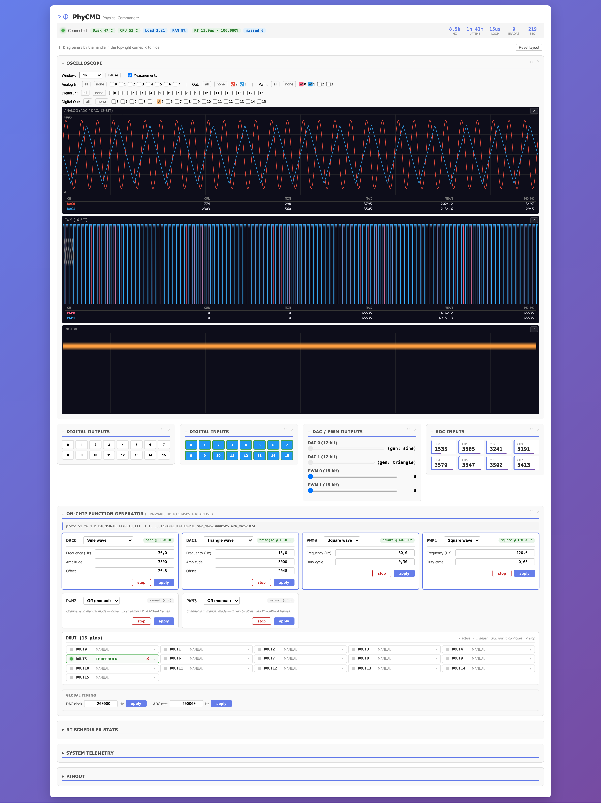
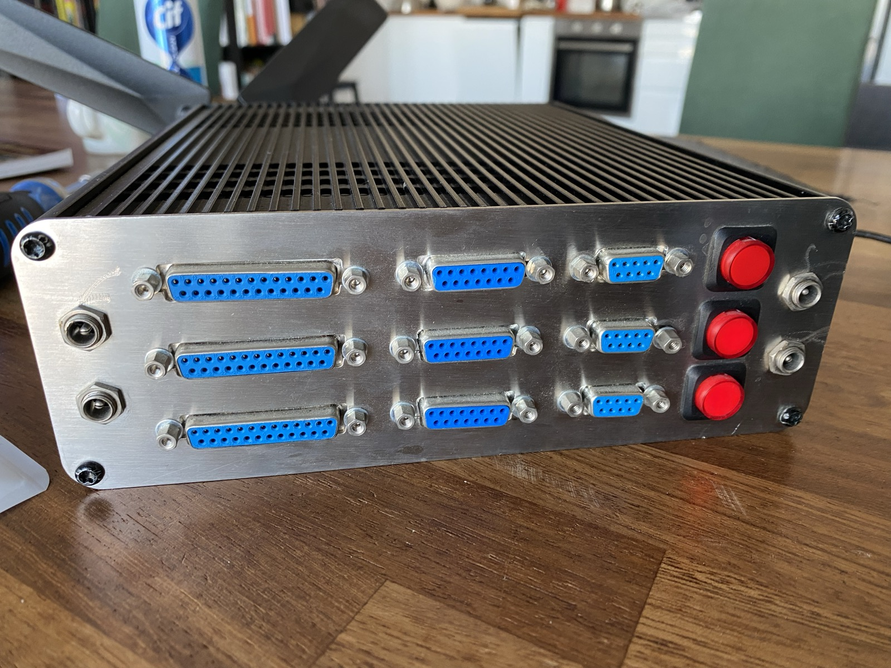
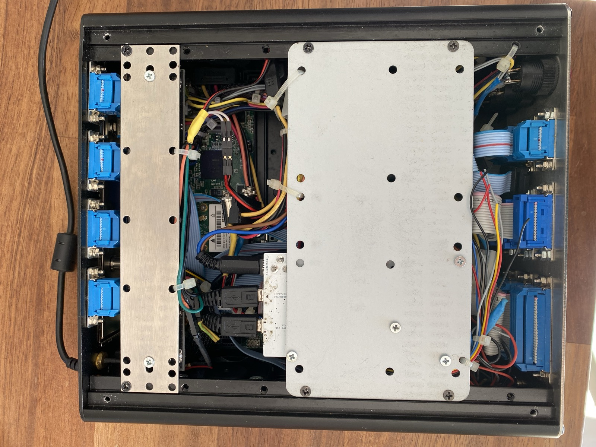
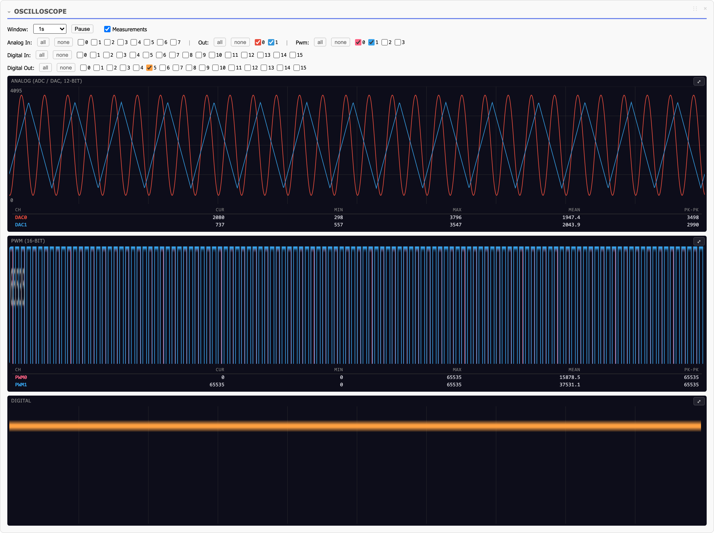
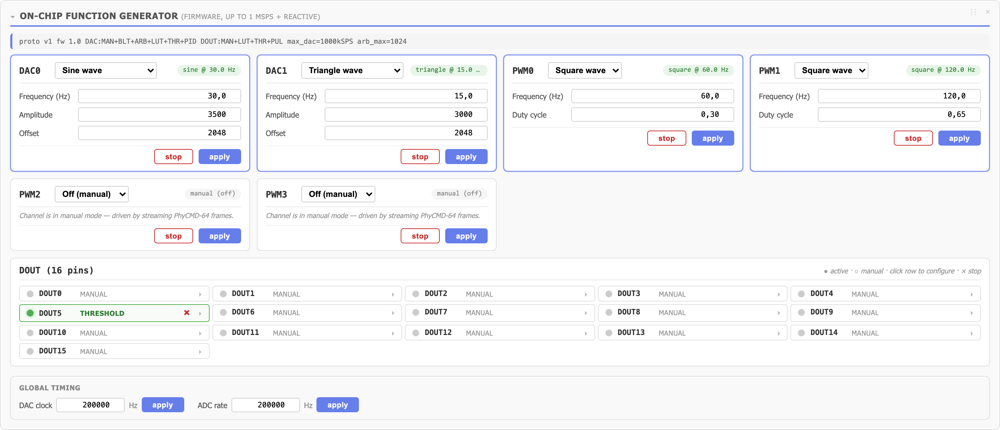
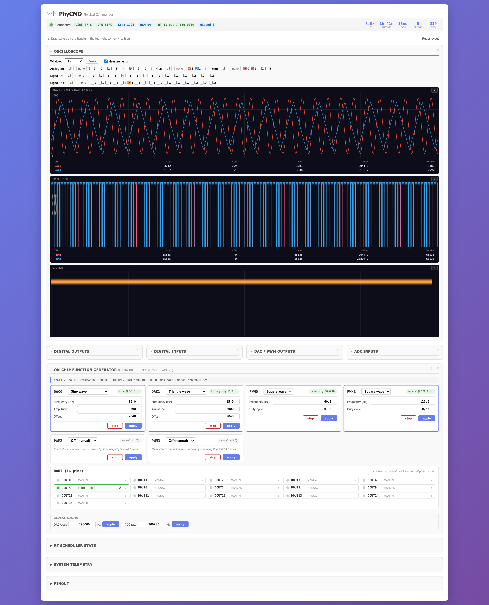
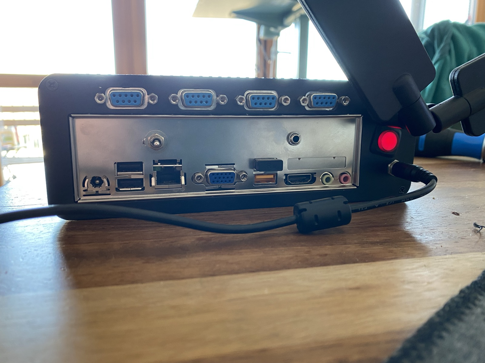
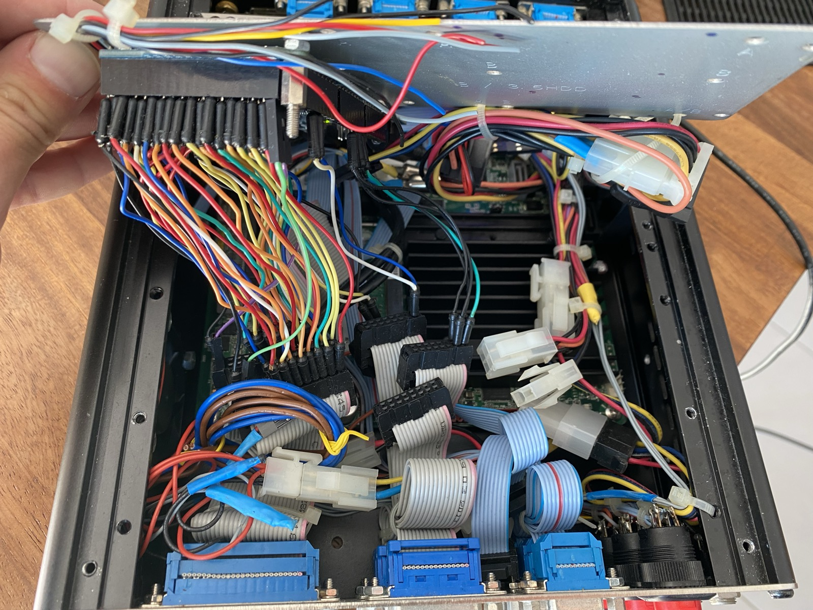

<p align="center">
  
</p>

<h1 align="center">PhyCMD — Physical Commander</h1>

<p align="center">
  <b>A programmable laboratory bench — signal generator, oscilloscope, DAQ card, and test rig collapsed into one scriptable system.</b>
</p>

<p align="center">
  <a href="#highlights">Highlights</a> ·
  <a href="#the-dashboard">Dashboard</a> ·
  <a href="#bill-of-materials">Bill of Materials</a> ·
  <a href="#quick-start">Quick start</a> ·
  <a href="#architecture">Architecture</a> ·
  <a href="#roadmap">Roadmap</a>
</p>

<p align="center">
  
  
  
  <br/>
  Designed & built by <b><a href="https://github.com/angleto">Angelo Leto</a></b> · 2014&nbsp;→&nbsp;2026
</p>

---

<p align="center">
  
</p>

## Why this project exists

Where a benchtop scope and signal generator are *manually operated*, PhyCMD is **programmable**. Where an Arduino sketch is *non-deterministic*, PhyCMD is **real-time**. Where a National Instruments DAQ is *proprietary*, PhyCMD is **end-to-end open** — from the firmware on the SAM3X8E up through the Rust streaming server and the browser dashboard.

You get an Intel mini-PC, an Arduino Due, a handful of protection components, and suddenly your lab has a sample-coherent 8 kHz DAC↔ADC↔DIN↔DOUT link with a PREEMPT\_RT Linux brain that can run PID loops, lock-in detectors, Kalman filters, frequency sweeps, or whatever else you care to script.

### A bit of history

PhyCMD started in **2014**. The reference Intel DN2800MT mini-PC, the aluminium chassis, the steel front panel (hand-drawn in AutoCAD — see [`docs/hardware/FrontPanel_2014.dwg`](docs/hardware/FrontPanel_2014.dwg)), the DB-25 I/O harness, and the SAM3X8E firmware's I/O core all date back to that build. The original host software was a small custom C/C++ bulk-USB broker. In 2026 the project was extended on both sides without changing the hardware: the firmware kept its proven I/O layer and grew an on-chip function generator + a switch from bulk to isochronous USB at 8 kHz; the host-side broker was replaced by the new Rust `physerver` and the browser dashboard you see in these screenshots.

<p align="center">
  
</p>

<p align="center">
  
</p>

## Highlights

- **8 kHz sample-coherent iso-USB link** — 64-byte PhyCMD frames every USB microframe (125 µs), HS isochronous EP on a dual-interface Vendor/CDC device.
- **On-chip function generator in firmware** — sine / square / triangle / sawtooth / arbitrary / LUT / threshold / pulse-trig / PID on 2 DACs, 4 PWM channels, 16 DOUTs. Up to 1 MSPS per DAC; DOUT reactive modes evaluated at 1 kHz.
- **Full dashboard in the browser** — live scope with analytic synth at canvas-pixel resolution, collapsible drag-and-drop panels, On-Chip FnGen controls per channel, PREEMPT\_RT scheduler telemetry with URB-level jitter histogram.
- **PREEMPT\_RT host** — source-based policy routing, CPU isolation (2,3), IRQ pinning — documented turn-key setup in [`docs/deployment/`](docs/deployment/).
- **Clean layered wire protocol** — the 64-byte frame is a single source of truth: `_Static_assert` in C, `const _: () = assert!(...)` in Rust. Any drift between firmware and host fails the build loudly.
- **Python, Rust, REST, WebSocket, and SHM IPC** — pick the surface that fits your workflow.

## The dashboard

Open `http://<host>:8080/` from any browser on your LAN.

### Oscilloscope with analytic rendering

<p align="center">
  
</p>

Because the WebSocket stream is throttled at ~250 Hz, anything above ~50 Hz would alias on a naive sampled trace. The scope therefore **evaluates the on-chip generator's waveform analytically at canvas-pixel resolution** for sine / square / triangle / sawtooth DACs and for PWM squares — so you see the real shape even at several kHz. Digital inputs and outputs and raw ADC traces are drawn from the captured sample buffer.

### On-Chip Function Generator

<p align="center">
  
</p>

Every DAC, PWM, and DOUT channel has its own row with mode dropdown, parameter form, Apply, and Stop. `userDirty` flag protects in-progress edits from being stomped by the 1 s state poll. The DOUT strip is a single 16-pin panel — click a row to expand the config, click × on the row head to stop a channel without expanding.

### Compact / mobile layout

<p align="center">
  
</p>

Every panel collapses to its header with a ▸ chevron; state is persisted in `localStorage`. Drag-handles stay visible even when collapsed so you can reorder the layout in either state.

## Bill of Materials

> Total cost of a fresh build is ≈ 180–250 € depending on the mini-PC. Sensors, actuators, and the DUT are obviously project-specific.

### Core compute & I/O

| Qty | Item | Notes | Typical price |
|-----|------|-------|---------------|
| 1 | Intel mini-PC with x86\_64 CPU, ≥ 2 GB RAM, USB 2.0 HS port | Reference box: **Intel DN2800MT** (Atom N2800, Cedar Trail) running Ubuntu 24.04 PREEMPT\_RT. Any similar fanless Atom/Celeron box works. A host with **xHCI** (USB 3.0+) instead of the reference **EHCI** controller handles iso-USB microframes more aggressively and can push the effective refresh rate well above 8 kHz — EHCI caps cleanly at HS-iso's 8 kHz, xHCI's per-bus scheduler should give lower jitter. | 40–120 € used |
| 1 | Arduino Due (SAM3X8E, 84 MHz Cortex-M3) | Native USB 2.0 HS. Stock board, no hardware mods. | 35 € |
| 1 | USB A → micro-B cable | Connect Due *native* port to the host. Programming port only needed for first flash. | 3 € |

### Connectivity & UI

| Qty | Item | Notes |
|-----|------|-------|
| 1 | Ethernet cable + switch / LAN router | Dashboard is served at `http://host:8080`. |
| 1 | Screen + keyboard (optional, first boot only) | After network setup all interaction is over SSH + browser. |

### Chassis & mechanics (reference build)

The reference enclosure, front / rear steel panels, and PSU-support bar are from the **2014 build**. The Amazon Italy listings below are the ones actually used — swap for local equivalents as you prefer. The front panel and the PSU-support bar were hand-drawn in AutoCAD (see [`docs/hardware/FrontPanel_2014.dwg`](docs/hardware/FrontPanel_2014.dwg)).

| Qty | Item | Amazon IT ASIN |
|-----|------|----------------|
| 1 | Compact aluminium rack/bench case with integrated vent grille | [B00GUFL76U](https://www.amazon.it/dp/B00GUFL76U) |
| 1 | Power / chassis accessory | [B00E7QGHE6](https://www.amazon.it/dp/B00E7QGHE6) |
| 1 | Power / chassis accessory | [B00COFMPAM](https://www.amazon.it/dp/B00COFMPAM) |
| 1 | Internal hardware kit (brackets / fasteners / cabling) | [B007BVDVAM](https://www.amazon.it/dp/B007BVDVAM) |
| 1 | Custom-cut steel front panel | Machined from the DWG above. 9 × DB-25F cut-outs + 3 push-button holes. |
| 1 | Custom-cut rear panel | Shaped around the mini-PC's native I/O (VGA/HDMI/USB/audio). |

<p align="center">
  
</p>

<p align="center">
  
</p>

### Signal-conditioning front-end (recommended hand-solder / through-hole)

The Due's DACs output 0.55–2.75 V and its ADCs expect 0–3.3 V — you usually want some protection + buffering around them. The project's author prefers **through-hole / DIP** parts and prebuilt buck/boost modules over SMT. [`docs/technical/PCB_BACKPLANE_PINOUT.md`](docs/technical/PCB_BACKPLANE_PINOUT.md) sketches a passive Arduino Due shield that fans out all I/O to nine DB-25 connectors following this rule — **the design is a paper sketch only, never fabricated**. See [Contributions wanted](#contributions-wanted) below.

| Qty | Item | Role |
|-----|------|------|
| 2 | Op-amp ×2 (MCP6002 / TL072 DIP-8) | DAC buffer & ADC input follower |
| 2 | Rail-to-rail op-amp or instrumentation amplifier | Scale DAC output to ±10 V (optional) |
| 16 | TVS diode (SMAJ3.3CA-like) | Clamp DIN pins to 0–3.3 V |
| 16 | 1 kΩ series resistor | DIN current-limit |
| 16 | 10 kΩ pull-down resistor | DIN default level |
| 16 | N-MOS logic-level (e.g. 2N7000) + 1 kΩ gate resistor | Level-shift DOUTs to whatever your load needs |
| 4 | 330 Ω + LED | Optional status LEDs on the PWM pins |
| 1 | Buck module 12 V → 5 V (prebuilt) | Power Arduino Due from the lab supply |
| 1 | Pluggable screw-terminal blocks | All external I/O lands here |
| 1 | Drilled aluminium or 3 mm ABS enclosure | See [`companion_board/panel_sketch/`](companion_board/panel_sketch/) for the front/rear panel SVGs (front/rear are realised on the reference build; `pcb_backplane_*.svg` is the not-yet-fabricated companion shield — see [Contributions wanted](#contributions-wanted)) |

### What you can skip

- **Real-time clock / battery.** Host NTP is enough; Due has its own 1 ms SysTick for `uptime_ms`.
- **Dedicated crystal oscillator.** Due's on-board 84 MHz is stable to ±50 ppm — plenty for audio-band work.
- **Fan PWM control.** The reference Intel DN2800MT has no hwmon path for fans; use the motherboard BIOS. If you must, the SAM3X PWM pins can drive a fan through a transistor.

## Quick start

```bash
# --- On the mini-PC (Ubuntu 24.04 LTS + PREEMPT_RT kernel) -----------
git clone https://github.com/<you>/phycommander.git
cd phycommander

# Build + flash firmware (ARM GNU Toolchain required)
cd ATSAM3X8E_FW/ATSAM3X8E_FW && make
# With Due in SAM-BA mode (stty -F /dev/arduino_due_prog 1200):
bossac --port=ttyACM1 -e -w -v -b build/phycmd_fw.bin
# See docs/firmware/FIRMWARE_UPLOAD.md for the RSTC-reset trick — bossac -R
# does NOT actually reset the SAM3X core.

# Build + install physerver
cd ../../physerver && cargo build --release
sudo cp target/release/physerver /usr/local/bin/
sudo cp ../deploy/systemd/physerver.service /etc/systemd/system/
sudo systemctl enable --now physerver

# Open the dashboard
xdg-open http://localhost:8080
```

For the full PREEMPT\_RT bring-up, dual-NIC policy routing, and systemd plumbing, see [`docs/deployment/DEPLOYMENT.md`](docs/deployment/DEPLOYMENT.md).

## Architecture

```
┌───────────────────────────────────────────────────────────────┐
│               Application Layer                               │
│  ┌──────────┐  ┌──────────┐  ┌──────────┐  ┌──────────┐       │
│  │  Browser │  │  Python  │  │  Rust    │  │  Test    │       │
│  │  (Dash)  │  │  (pyo3)  │  │  Custom  │  │  Scripts │       │
│  └─────┬────┘  └────┬─────┘  └────┬─────┘  └────┬─────┘       │
│    WebSocket     IPC (SHM)    Rust crate     REST / curl      │
└────────┼────────────┼─────────────┼─────────────┼─────────────┘
         │            │             │             │
┌────────┴────────────┴─────────────┴─────────────┴─────────────┐
│              physerver (Rust, PREEMPT_RT)                     │
│  • IsoTransport — 8 kHz HS isochronous USB on EP1 IN/OUT       │
│  • WaveformBank, CommandStaging, StatusBus                    │
│  • Web (axum), WS broadcast, sysinfo, RT stats                │
│  • Vendor SETUP client for on-chip generator control          │
└──────────────────────────────┬────────────────────────────────┘
                               │  USB 2.0 HS (Vendor iso + Vendor EP0 control)
┌──────────────────────────────┴────────────────────────────────┐
│              SAM3X8E firmware (ATSAM3X8E_FW/)                 │
│  • PhyCMD-64 wire protocol (CRC-16-CCITT)                     │
│  • 2 DAC + 4 PWM + 16 DOUT + 16 DIN + 8 ADC                   │
│  • On-chip generator: BUILTIN / ARBITRARY / LUT / THRESHOLD / │
│    PULSE_TRIG / PID — per-channel, per-microframe             │
│  • DACC PDC ping-pong, TC-triggered ADC, PWM peripheral B     │
└────────────────────────────────────────────────────────────────┘
```

## Project layout

| Path | Contents |
|------|----------|
| `ATSAM3X8E_FW/` | SAM3X8E firmware (ARM GCC + ASF, GNU Make) |
| `physerver/` | Rust streaming server + dashboard (Cargo workspace) |
| &nbsp;&nbsp;`physerver/crates/phycmd-core/` | wire protocol, transports, scheduler, stats |
| &nbsp;&nbsp;`physerver/crates/phycmd-rust/` | public Rust client crate |
| &nbsp;&nbsp;`physerver/crates/phycmd-py/` | `pyo3` Python bindings |
| &nbsp;&nbsp;`physerver/static/` | dashboard (single-page, no build step) |
| `docs/` | protocol, firmware, deployment, applications |
| `deploy/` | systemd units, udev rules, policy-routing scripts |
| `companion_board/panel_sketch/` | front / rear / backplane SVGs for the enclosure |
| `scripts/` | CLI tools (`phycmd_waveform.py`, `deploy.sh`, …) |

## Roadmap

- **v2.0** — live watchdog + crash-state dump from firmware; host-side auto-recovery over USB reset instead of SAM-BA reflash.
- **v3.0** — rule-chain mode (`MODE_RULE_CHAIN`) for composing reactive primitives on-chip without round-tripping to the host.
- **v4.x** — second supported MCU (SAMD51 / RP2350) with the same wire protocol.
- **Long term** — pluggable front-end PCB with galvanic isolation and ±10 V amplifiers, designed hand-solder-first.

## Contributions wanted

PhyCMD is maintained solo and a few useful pieces are **sketched but not built**. Concrete help with any of these lands faster than broad feature requests:

- **Fabricate the companion shield PCB.** [`docs/technical/PCB_BACKPLANE_PINOUT.md`](docs/technical/PCB_BACKPLANE_PINOUT.md) describes a passive Arduino Due shield that fans out all I/O to nine DB-25 connectors on the front panel, replacing the hand-crimped wire harness shown in the photos. The pinout is decided, the 1:1 layer SVGs are in [`companion_board/panel_sketch/`](companion_board/panel_sketch/), and a KiCad-8 skeleton sits under [`companion_board/pcb/`](companion_board/pcb/) — but **nothing has been fabricated or validated**. Pull-request-ready help would be: clean KiCad project, generated gerbers, a built prototype with continuity + signal-integrity notes.
- **Front-end analog conditioning.** The BOM above is a recommended parts list, not a validated schematic — an actual op-amp buffer + ADC protection daughterboard (DIP, hand-solderable, documented) would save everyone time. Bonus points for optional ±10 V rail-to-rail scaling.
- **xHCI benchmarking.** The reference host has EHCI only; somebody with an xHCI machine can characterise jitter / max effective refresh rate and contribute a short report + `docs/technical/XHCI_NOTES.md`.
- **Watchdog-driven crash recovery.** Firmware currently has to be SAM-BA reflashed after a rare wedge (see session history). A firmware watchdog + host-side auto-reset over USB would eliminate this.
- **Non-reference deployments.** If you get it running on a different mini-PC / different Linux distro, open a PR against [`docs/deployment/DEPLOYMENT.md`](docs/deployment/DEPLOYMENT.md) with the delta.

Issues tagged `help wanted` on GitHub track these. Pull requests for smaller polish work (docs, typos, small refactors) also very welcome.

## License & authorship

PhyCMD is © 2014-2026 **Angelo Leto** ([@angleto](https://github.com/angleto)).

- **Software** (firmware, Rust server, dashboard, scripts): dual-licensed **MIT OR Apache-2.0** — pick whichever fits your use case. See [`LICENSE-MIT`](LICENSE-MIT) and [`LICENSE-APACHE`](LICENSE-APACHE).
- **Hardware designs, panel CAD, photos, and long-form prose docs**: **CC-BY-SA 4.0** — attribution + share-alike. See [`LICENSE-CC-BY-SA-4.0`](LICENSE-CC-BY-SA-4.0).
- The top-level [`LICENSE`](LICENSE) summarises the whole arrangement; [`NOTICE`](NOTICE) carries the project attribution that redistributions must preserve.

If you build on PhyCMD — academic paper, product, student project, blog post — credit would be appreciated in whichever form fits (README line, paper citation, slide footer).

## Documentation index

A complete, navigable documentation index lives in [`docs/INDEX.md`](docs/INDEX.md). Highlights:

- [Protocol reference](docs/firmware/PROTOCOL.md) — PhyCMD-64 wire format + vendor SETUP requests
- [Function Generator guide](docs/user-guide/FUNCTION_GENERATOR.md) — all on-chip modes with examples
- [Deployment playbook](docs/deployment/DEPLOYMENT.md) — PREEMPT\_RT host bring-up
- [User manual](docs/user-guide/USER_MANUAL.md) — dashboard walkthrough
- [Example application](docs/applications/LOCKIN_OPTICAL_DEMO.md) — lock-in optical demo, end to end
