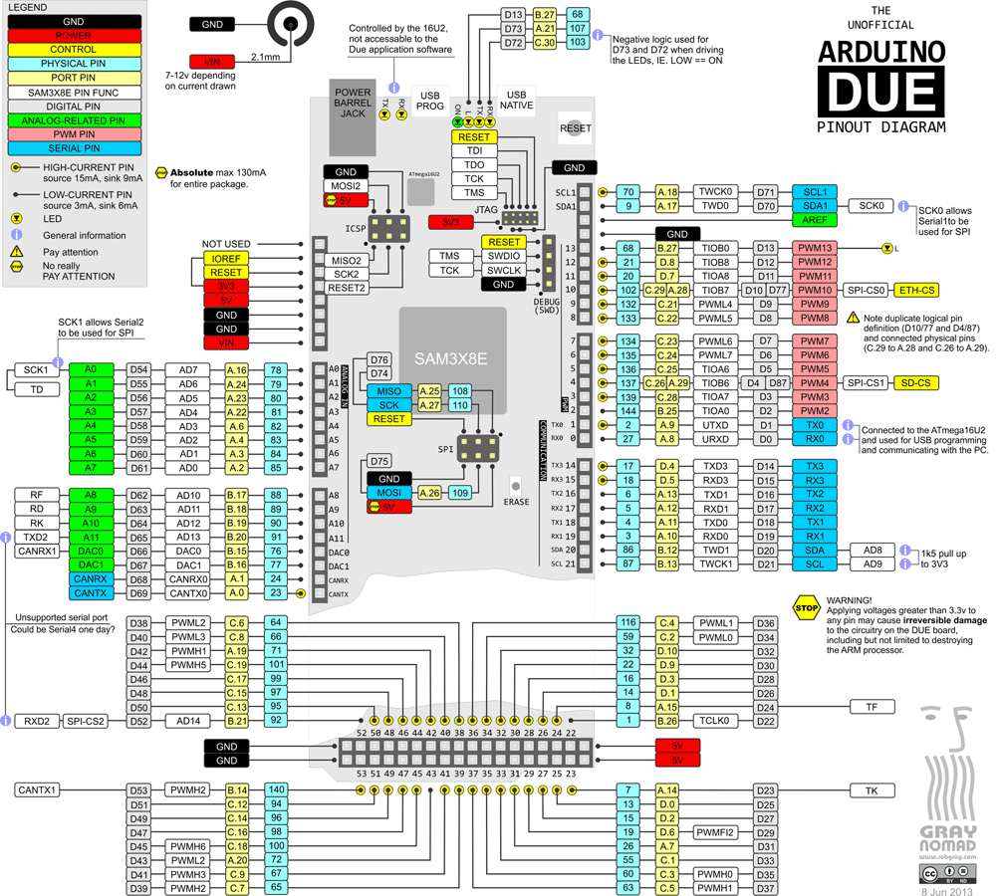

# PhyCommander — Arduino Due pin assignment

Authoritative map of which SAM3X8E pin does what in the PhyCommander
firmware. When you physically wire the front panel to the Due, use
the **Arduino D-label** (the number silkscreened on the top layer of
the board); internal references in the firmware use the SAM3X PIO
symbol (e.g. `PIO_PC21_IDX`), which the Arduino label table below
translates.

See [`arduino-due-pinout.png`](arduino-due-pinout.png) for the
full-resolution reference (the Arduino.cc pinout diagram). Every D-
and A-label mentioned in the sections below is the one shown on
that image and silkscreened on the top layer of the board.

> **Conventions**
>
> - "Due label" = the number silkscreened on the Arduino Due PCB
>   (e.g. `D22`, `A0`, `DAC0`). This is what you read when you plug
>   in a jumper.
> - "SAM3X pin" = the chip-level port + bit (e.g. `PA14`, `PB27`).
> - "Protocol index" = the array slot in the phycmd wire frame
>   (`adc[3]`, `dout[7]`, …). These are what the REST / WebSocket
>   clients see.
> - All 12 ADC channels (`adc[0..11]`), both DACs, the 8 PWM
>   channels (`pwm[0..7]`) and the 16 DIN / 16 DOUT slots are
>   **live on the current release** (v2.0). SPI, I2C, CAN
>   availability depends on firmware feature flags — see the
>   "status" column in §6.

---

## 1. Analog outputs (DAC)

| Wire field | Due label | SAM3X pin | Output range | Status |
|---|---|---|---|---|
| `dac[0]` | `DAC0` | PB15 | ~0.55–2.75 V | ✅ Active |
| `dac[1]` | `DAC1` | PB16 | ~0.55–2.75 V | ✅ Active |

> **Range caveat.** The Arduino Due's on-chip DAC is not rail-to-rail.
> Code `0` produces ~0.55 V, code `4095` produces ~2.75 V (ref:
> Atmel SAM3X datasheet §41.6.1). If you need 0–3.3 V swing you must
> add a buffer/opamp + gain stage off-board.

---

## 2. Analog inputs (ADC)

Arduino Due exposes 12 analog inputs (`A0`–`A11`) and the firmware
now publishes all 12 in the wire frame. **Important:** the Arduino
A-label is *reversed* relative to the SAM3X AD channel number on
Port A — `A0` on the silkscreen is **SAM3X AD7** internally, `A7` is
**AD0**. Port-B pins (Due `A8`..`A11`) follow a different mapping
(AD10..AD13). The 12-slot `g_adc_cdr_map[]` in `main.c` reorders
both ranges so the wire array indexes are linear.

Each analog pin also has a D-number alias (`A0`=`D54`, `A1`=`D55`,
…, `A11`=`D65`); most Due pinout reference images tag the same pin
with `ADC<n>` where `<n>` tracks the A-number, NOT the SAM3X AD
channel. Keep the three name spaces straight:

  * `A<n>` / `D(54+n)` / `ADC<n>` — what the Due PCB and pinout
    image agree on (n = 0..11).
  * SAM3X AD channel — what the chip datasheet and register layout
    use.
  * `adc[i]` in our wire protocol — `i = n` (linear A0..A11).

| Due label | SAM3X pin | SAM3X AD | `status.adc[]` |
|---|---|---|---|
| `A0`  | PA16 | AD7  | `adc[0]` |
| `A1`  | PA24 | AD6  | `adc[1]` |
| `A2`  | PA23 | AD5  | `adc[2]` |
| `A3`  | PA22 | AD4  | `adc[3]` |
| `A4`  | PA6  | AD3  | `adc[4]` |
| `A5`  | PA4  | AD2  | `adc[5]` |
| `A6`  | PA3  | AD1  | `adc[6]` |
| `A7`  | PA2  | AD0  | `adc[7]` |
| `A8`  | PB17 | AD10 | `adc[8]` |
| `A9`  | PB18 | AD11 | `adc[9]` |
| `A10` | PB19 | AD12 | `adc[10]` |
| `A11` | PB20 | AD13 | `adc[11]` |

> **API numbering is intuitive**: `status.adc[i]` follows the physical
> Due silkscreen `A0..A11` in order. `ADC_CHER` is set to `0x3CFF`
> (AD0..AD7 + AD10..AD13). `AD8` (`PB12`) and `AD9` (`PB13`) are NOT
> on the analog header on Arduino Due — they're routed to other
> peripherals. `AD14` (`PB21`) shares its pad with `DIGITAL_INPUT_15`
> so the firmware deliberately leaves it disabled in `CHER`; enabling
> it would silently capture the pad and break `DIN[15]` reads. `AD15`
> (`PB15`) is the `DAC0` pad — same lock-out for the same reason.

Sampling uses the SAM3X ADC's **FREE-RUN mode**: the peripheral
cycles through all enabled channels continuously and latches each
result into the per-channel `ADC_CDR[N]` register. `build_status_frame`
snapshots those registers when the host asks for a status frame; no
PDC, no SOF trigger, no scan-order dependency. The earlier
PDC + SOF-triggered path produced reproducible "stuck-at-0x800"
readings on any channel with index > 6 in a sparse enabled set —
see commit `ffde516` for the analysis.

---

## 3. PWM

The firmware exposes **8 PWMs** (`pwm0`..`pwm7`). Channels 0..3 use
the SAM3X PWM peripheral (PWMH4..PWMH7) and run on independent
timers. Channels 4..7 are Timer-Counter backed (TC blocks) — each
uses one TIOA/TIOB output of a TC channel that no other firmware
PWM occupies, so periods are independent across all 8 channels.

CPOL=1 on PWMH, default carrier 1 kHz for manual streaming via the
dashboard slider, user-selectable frequency via `POST
/api/fngen/play_builtin/pwm<n>`. Duty = 0 → pin LOW, duty = max →
pin HIGH (standard convention).

| Wire / fngen | Due label | SAM3X pin | Peripheral path |
|---|---|---|---|
| `pwm0` | `D9`  | PC21 | PWMH4 |
| `pwm1` | `D8`  | PC22 | PWMH5 |
| `pwm2` | `D7`  | PC23 | PWMH6 |
| `pwm3` | `D6`  | PC24 | PWMH7 |
| `pwm4` | `D10` | PC29 | TC2.ch1 TIOB (TC7) |
| `pwm5` | `D11` | PD7  | TC2.ch2 TIOA (TC8) |
| `pwm6` | `D5`  | PC25 | TC2.ch0 TIOA (TC6) |
| `pwm7` | `D2`  | PB25 | TC0.ch0 TIOA (TC0) |

> The 64-byte streaming Command frame carries two PWM slots
> (`pwm[0]`, `pwm[1]`); the other six are configurable only via
> `fngen`. The dashboard slider for every channel posts to
> `/api/fngen/play_builtin/pwm<n>` so behaviour is consistent
> across slots.
>
> ⚠️ **Naming gotcha.** The Arduino Due silkscreens each PWM-capable
> pin with the D-pin number (`PWM6`..`PWM11` for `D6`..`D11`), NOT
> with a sequential `pwm0..pwm7` index. Firmware `pwm0` lives on the
> pin the board labels `PWM9`. When someone references "PWM7" on the
> hardware they mean Due `D7` — i.e. firmware `pwm2`.

### 3.1 Pins reserved for non-PWM use on the bench

| Due label | SAM3X pin | Use |
|---|---|---|
| `D3`  | PC28 | Front-panel reset button input (active-low, 50 ms debounce; pressing triggers `RSTC_CR = 0xA500000D`). |
| `D4`  | PC26 | Reserved for future use. Has a TIOB6 alternate function but pairing it with `pwm6=D5` (TIOA6 same TC channel) would force a shared period. |
| `D12` | PD8  | Reserved for future use. Pairs with `pwm5=D11` on TC2.ch2 — exposing as PWM would share that period. |
| `D13` | PB27 | Heartbeat LED — see §5. |

---

## 4. Digital I/O

Firmware convention (pre-2.0 and kept): **odd D-number = output,
even D-number = input**. Wire as loopback pairs D(2k)↔D(2k+1) for
self-test. All DIN pins have internal pull-ups enabled.

### 4.1 Digital outputs (DOUT, 16 channels)

| Wire bit | Due label | SAM3X pin |
|---|---|---|
| `digital_out` bit 0 | `D23` | PA14 |
| bit 1 | `D25` | PD0 |
| bit 2 | `D27` | PD2 |
| bit 3 | `D29` | PD6 |
| bit 4 | `D31` | PA7 |
| bit 5 | `D33` | PC1 |
| bit 6 | `D35` | PC3 |
| bit 7 | `D37` | PC5 |
| bit 8 | `D39` | PC7 |
| bit 9 | `D41` | PC9 |
| bit 10 | `D43` | PA20 |
| bit 11 | `D45` | PC18 |
| bit 12 | `D47` | PC16 |
| bit 13 | `D49` | PC14 |
| bit 14 | `D51` | PC12 |
| bit 15 | `D53` | PB14 |

### 4.2 Digital inputs (DIN, 16 channels)

| Wire bit | Due label | SAM3X pin |
|---|---|---|
| `digital_in` bit 0 | `D22` | PB26 |
| bit 1 | `D24` | PA15 |
| bit 2 | `D26` | PD1 |
| bit 3 | `D28` | PD3 |
| bit 4 | `D30` | PD9 |
| bit 5 | `D32` | PD10 |
| bit 6 | `D34` | PC2 |
| bit 7 | `D36` | PC4 |
| bit 8 | `D38` | PC6 |
| bit 9 | `D40` | PC8 |
| bit 10 | `D42` | PA19 |
| bit 11 | `D44` | PC19 |
| bit 12 | `D46` | PC17 |
| bit 13 | `D48` | PC15 |
| bit 14 | `D50` | PC13 |
| bit 15 | `D52` | PB21 |

---

## 5. Dedicated / status pins

| Due label | SAM3X pin | Role | Notes |
|---|---|---|---|
| `D13` | PB27 | **Firmware heartbeat LED** | On-board "L" LED. Firmware blinks 1 Hz when iso transport is healthy, ~4 Hz before USB enumeration, solid ON on unrecoverable error. See `main.c::SysTick_Handler` for the state machine. NOT user-controllable — do not wire anything to it. |
| `D3`  | PC28 | **Front-panel reset button** | Active-low input with internal pull-up. Wired between `D3` and `GND`. Held LOW for 50 consecutive ms triggers `RSTC_CR = key(0xA5) \| PROCRST \| PERRST \| EXTRST` — full hardware reset, identical to what `flash_firmware.sh` issues over SAM-BA. See `main.c::SysTick_Handler`. |

---

## 6. Peripheral buses (reserved, available to the firmware for future use)

### 6.1 UART

| Bus | TX Due label | RX Due label | SAM3X pins | Status |
|---|---|---|---|---|
| Serial (UART0, programming port) | `D1` | `D0` | PA9 / PA8 | 🔒 **Don't touch** — the ATmega16U2 USB-UART bridge and the `flash_firmware.sh` 1200-baud trick both live on this bus. Using D0/D1 as GPIO breaks the flash flow. |
| Serial1 (USART0) | `D18` | `D19` | PA11 / PA10 | ✅ Free — can be repurposed as extra DIN/DOUT or as external UART |
| Serial2 (USART1) | `D16` | `D17` | PA13 / PA12 | ✅ Free |
| Serial3 (USART3) | `D14` | `D15` | PD4 / PD5 | ✅ Free |

### 6.2 I²C

| Bus | Due label | SAM3X pin | Status |
|---|---|---|---|
| Wire (I²C0, TWI0) | `D20` (SDA) | PB12 | ⚠️ Reserved — if you add I²C sensors (BME280 environmental, SI7021 humidity, etc.), wire them here. |
| | `D21` (SCL) | PB13 | |
| Wire1 (I²C1, TWI1) | `D70` = `SDA1` | PA17 | ⚠️ Reserved — on the analog header after `A11` |
| | `D71` = `SCL1` | PA18 | |

### 6.3 SPI

| Signal | Due label | SAM3X pin | Notes |
|---|---|---|---|
| MISO | ICSP header pin 1 (also `D74`) | PA25 | |
| MOSI | ICSP header pin 4 (also `D75`) | PA26 | |
| SCK | ICSP header pin 3 (also `D76`) | PA27 | |
| SS0 (CS canonical) | `D10` | PA28 | **conflicts with `pwm4`** — if SPI is enabled, `pwm4` (D10) loses its TC TIOB7 routing |
| SS1 | `D4` | PC26 | currently reserved (no PWM) — free for SPI use |
| SS2 | `D52` | PB21 | **conflicts with `din[15]`** — if SPI slaves are added, `din[15]` moves |

The ICSP header MISO/MOSI/SCK lines are shared with the SWD/JTAG
debug interface. Do not use them as GPIO.

### 6.4 CAN bus (your DB9 on the back panel)

SAM3X has two independent CAN controllers; **only CAN0 is easy to
wire on the Arduino Due**, CAN1 conflicts with existing signals.

| Bus | Signal | SAM3X pin | Accessible on Due? | Status |
|---|---|---|---|---|
| CAN0 | CANRX0 | PA1 | Brought out to pad `CANRX` (near `D0`/`D1`, dedicated CAN holes on some Due revs; **not** on the main digital header) | ✅ Free — route to rear DB9 |
| CAN0 | CANTX0 | PA0 | Brought out to pad `CANTX` | ✅ Free |
| CAN1 | CANRX1 | PB14 | **same pin as `dout[15]`** — conflict | 🔒 Blocked until `dout[15]` is remapped |
| CAN1 | CANTX1 | PB15 | **same pin as `DAC0`** — conflict | 🔒 Blocked |

For your use case (single CAN bus → rear DB9 connector): **use CAN0
(PA0 / PA1)**, wire directly to a CAN transceiver chip (MCP2551,
TJA1050, etc.), then to the DB9. The Arduino Due doesn't have a CAN
transceiver on-board — you need to add one.

---

## 7. Do-not-touch list (hardware-critical)

| Pin | Why |
|---|---|
| `D0` / `D1` (UART0) | Programming-port USB-serial bridge. Needed for the flash flow. |
| `AREF` | Analog reference input. Leaving it floating lets the internal 3.3 V reference dominate; driving it as GPIO shorts the reference. |
| ICSP header (MISO/MOSI/SCK/RESET) | JTAG/SWD debug fallback + factory programming; also SPI. |
| `D13` (`PB27`) | On-board LED (firmware-managed status indicator). Wiring a load to it fights the LED. |
| `RESET` button | Only hardware path to recover from a firmware hang. Keep accessible. |
| `ERASE` button | Factory-erase fallback when the `flash_firmware.sh` 1200-baud trick fails. |

---

## 8. Available-but-unused pins (for future expansion)

After accounting for all of the above, these SAM3X pins are not
claimed by any firmware role and are free for future features:

- `D14`–`D19` (USART1/2/3 pairs — 6 pins) — if you don't need
  extra serial ports, reusable as DOUT/DIN or further PWM candidates.
- `D68`, `D69` (CAN pads, after CAN0 routing) — technically reusable.
- Analog `A8`–`A11` (PB17–PB20) — reserved for future 12-channel ADC
  support.
- The "TWI0" (I²C0) and "TWI1" (I²C1) pins if you don't plan to
  use I²C.

---

## 9. Quick sanity-check procedure

After any firmware change that touches pin assignments:

1. Flash the new firmware (`./scripts/flash_firmware.sh`).
2. Run the DOUT/DIN loopback (the `selftest` integration tests, or
   the bench loopback walking-ones/zeros — they each cover all 16
   bits and fail with which-bit-broke).
3. Run the DAC→ADC loopback (assumes the bench wiring `DAC0→A0`
   and `DAC1→A1`): `bench_dac0_linearity` + `bench_dac1_linearity`
   in `physerver/tests/bench_loopback.rs`. Slope ~0.674, R² > 0.98.
4. Run the PWM→ADC loopback on `pwm0..pwm7` via
   `/api/fngen/play_builtin/pwmN` with `shape=square`. The
   bench-default wiring is documented in `bench_loopback.rs`
   (pwm0→A9, pwm1→A8, pwm2→A7, pwm3→A6, pwm4→A10, pwm5→A11,
   pwm6→A5, pwm7→A2).
5. `curl /api/health` must return 200 with `iso_in_rate_hz` ≈ 8000.
6. `curl /api/fngen/caps` must report `num_dac:2 num_pwm:8 num_dout:16
   num_din:16 num_adc:12`.
